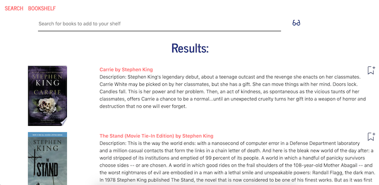
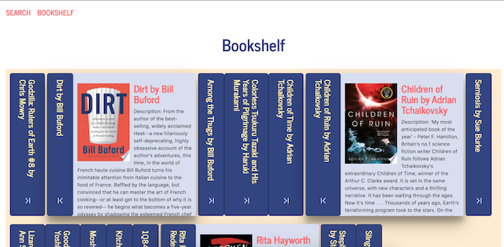

# bookshelf
Create your own bookshelf powered by Google Books

## technologies used

This app is built using a MongoDB and an Node.js Express router. This app is rendered via React. There are several CSS/state based animations. 

Dependencies:
   * axios
   * express
   * if-env
   * mongoose
   * react
   * react-dom
   * react-icons
   * react-router-dom

## use

Please run an "npm install" command to ensure you have the appropriate dependencies. After starting your server, please run "npm start" to launch the app.

## project screenshots

The app has the following user interfaces:

 *  - Default appearance for the search page
 
 *  - Search results are dynamically rendered using information from the Google Books API
 
 *  - User's saved book spines are rendered from Mongodb results. Spines can be clicked to trigger an animation that "opens" the book to provide additional info.

## project story

This project was developed to meet the following requirements:

  * Search - User can search for books via the Google Books API and render them here. User has the option to "View" a book, bringing them to the book on Google Books, or "Save" a book, saving it to the Mongo database.

  * Saved - Renders all books saved to the Mongo database. User has an option to "View" the book, bringing them to the book on Google Books, or "Delete" a book, removing it from the Mongo database.

Connects to a MongoDB database named `googlebooksdb` using the mongoose npm package.

The following information is saved when a user adds a book to their bookshelf:

* `title` - Title of the book from the Google Books API

* `authors` - The books's author(s) as returned from the Google Books API

* `description` - The book's description as returned from the Google Books API

* `image` - The Book's thumbnail image as returned from the Google Books API

* `link` - The Book's information link as returned from the Google Books API
